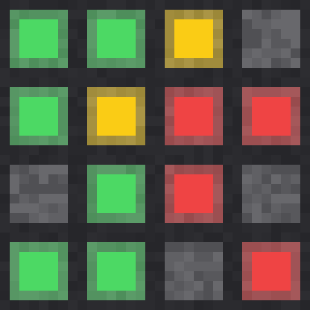
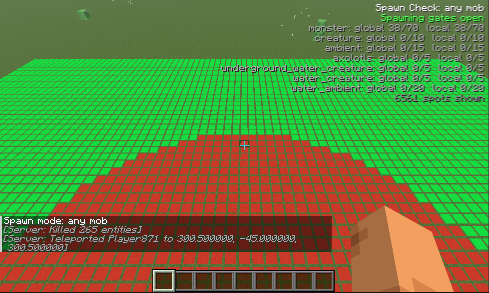
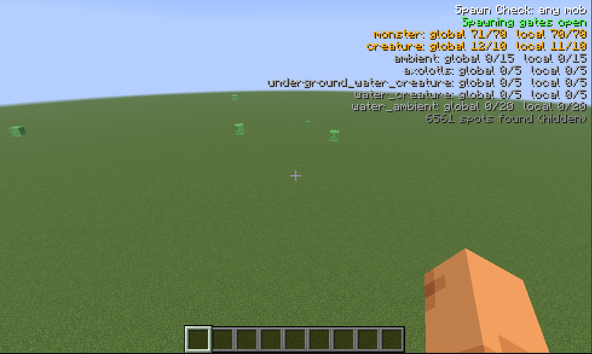
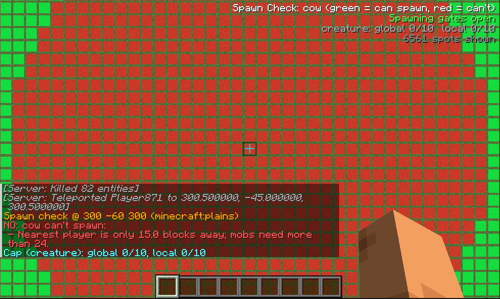
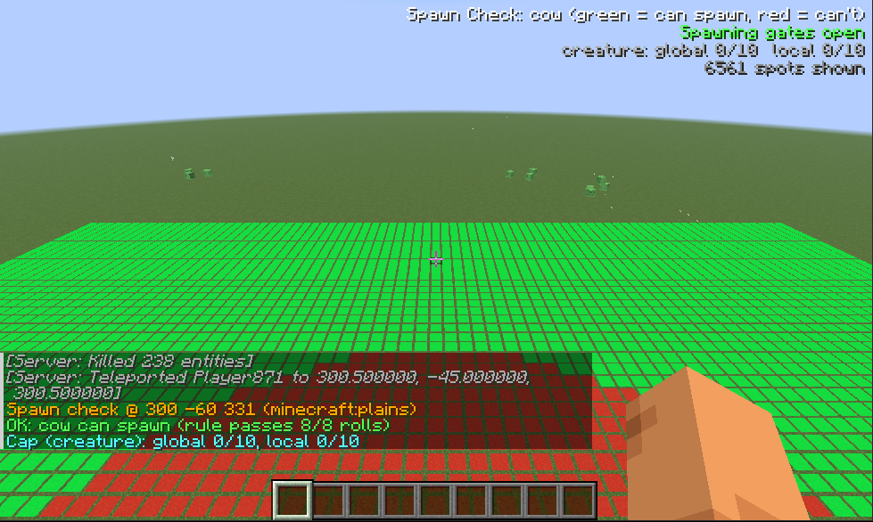
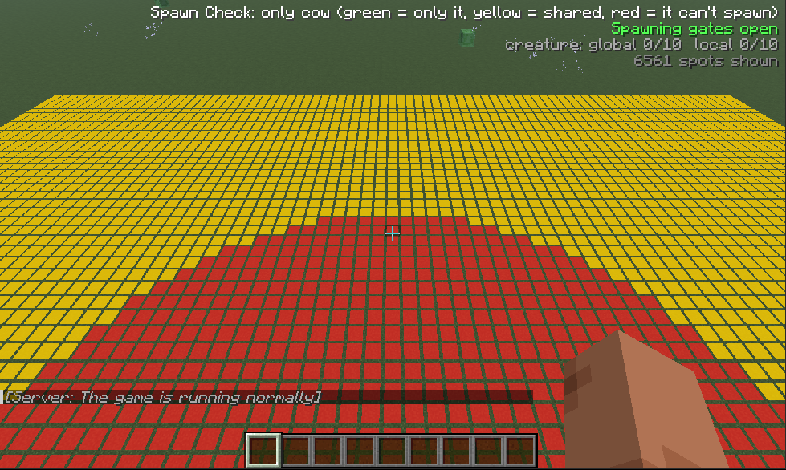
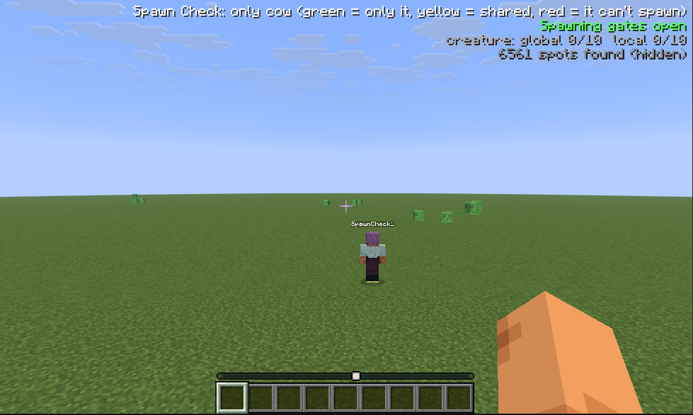
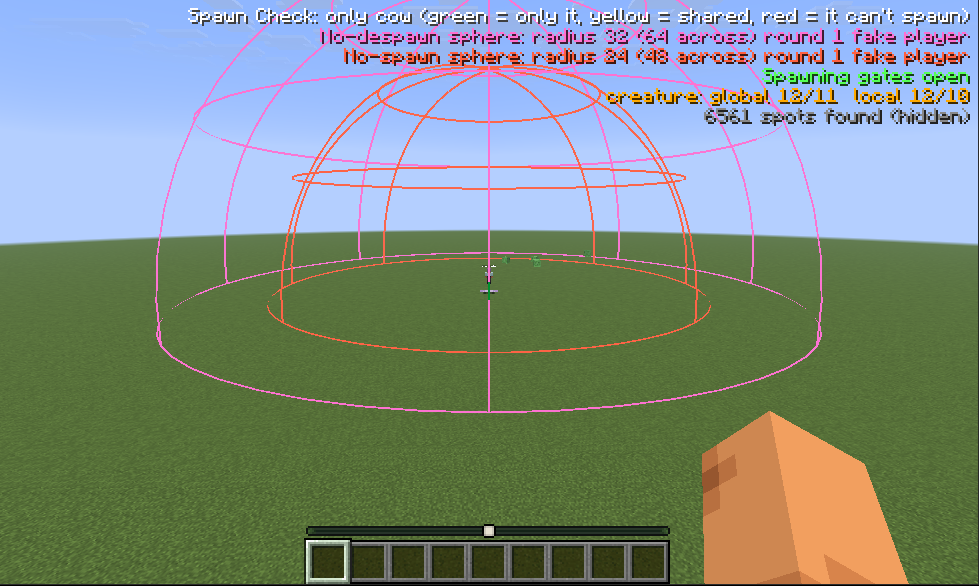

<!-- GENERATED FILE: edit README.template.md instead (see tools/RenderReadme.java). -->
<p align="center"></p>

# Spawn Check

A **Fabric** and **NeoForge** mod for **Minecraft {{minecraftVersion}}** that shows where mobs will **actually** spawn, and tells you exactly why they won't where they don't. It is built for debugging mob farms.

Looking at light levels and block types only gets you so far: a spot can look perfect and still never spawn anything because the mob cap is full, the chunk isn't entity-ticking, the nearest player is 23 blocks away, the biome has no entry for that mob, or a spider's 1.4-block-wide hitbox doesn't fit. Spawn Check re-implements the checks vanilla's natural spawner makes for a single block position, runs them for every open floor spot around you, and paints the answer in the world.

> The Minecraft version shown in this README is not typed in by hand: it is read from `minecraftVersion` in [gradle.properties](gradle.properties)
> and filled in by `tools/RenderReadme.java` (run automatically on every push to `main`). Edit `README.template.md`, not `README.md`.

## Features

- **Spawn spots** painted on the floor: green where the mob can spawn right now, red where it can't. Three modes: *any* mob, one *specific* mob, or *only* that mob (yellow where other mobs can spawn there too).
- **"Why not?"**: look at a spot and press a key (or run `/spawncheck why`) for every failed requirement in chat: light, block below, headroom, hitbox size, biome spawn list, distance to players, mob caps, difficulty, gamerules and more.
- **HUD** in the upper right: whether spawning is switched off level-wide, the global and local mob caps for the category, how many spots were found.
- **Spheres** around a player for the three distances that matter to a farm: nothing spawns within **24** blocks, mobs never despawn within **32**, and mobs despawn at once beyond **128**.
- **Fake players**: stand-in players that count for spawning, so you can test a farm while you watch from spectator mode, and draw the spheres around them.
- Scan any area (`/spawncheck at`), up to 128 blocks horizontally and as tall as the world.

## Screenshots



*Spawn spots in `any` mode. Green is a spot where something can spawn; the red disc is the 24 blocks around the player, where nothing can.*

| | |
| --- | --- |
|  |  |
| **HUD.** Spawning gates, the global and local mob cap of every category (orange when full) and the number of spots found. | **`N` on a red spot.** Every failed requirement, in chat. Here: a player is closer than 24 blocks. |
|  |  |
| **`N` on a green spot.** The rule passes, and how many of its 8 rolls did. | **`only` mode.** Yellow means the chosen mob can spawn there, but so can others. |
|  |  |
| **Fake player.** A stand-in that counts for spawning, so you can test a farm from spectator mode. | **With spheres.** The 24-block no-spawn sphere (orange) and the 32-block no-despawn sphere (pink) around the fake player. |

## Requirements

- Minecraft **{{minecraftVersion}}**
- **Fabric**: [Fabric Loader](https://fabricmc.net/use/) {{fabricLoaderVersion}} or newer and [Fabric API](https://modrinth.com/mod/fabric-api). **NeoForge**: [NeoForge](https://neoforged.net/) {{neoforgeVersion}} or newer.
- Java 25 (the Java Minecraft {{minecraftVersion}} itself uses)

The analysis runs on the **server**, so the mod must be installed there too (in single player that is automatic), and each player who wants the overlay needs it on their client. On a server, only operators (permission level 2 or higher) can use it; a player without the permission gets a message instead of results. A client that joins a server without the mod simply sees "Server doesn't have Spawn Check".

## Download and install

Current target: **Minecraft {{minecraftVersion}}**, mod version **{{version}}**.

Jars are on the [Releases page](../../releases): `spawncheck-fabric-{{minecraftVersion}}-<version>.jar` and `spawncheck-neoforge-{{minecraftVersion}}-<version>.jar`. The easy way is the install script for your OS, which also fetches Fabric API if you are on Fabric and don't have it. Or do it by hand: put the jar for your loader (and, on Fabric, Fabric API) in your `mods` folder.

### Install scripts

| OS | Script |
| --- | --- |
| Windows (PowerShell) | `install-windows.ps1` |
| Linux | `install-linux.sh` |
| macOS | `install-macos.sh` |

Each script installs Spawn Check into a `mods` folder and, on Fabric and unless told not to, **Fabric API** (downloaded for the right Minecraft version, and **only if the folder has no `fabric-api-*.jar` yet**; an existing one is never replaced). Older Spawn Check jars for the same loader are always replaced, so two versions never load together. Fabric Loader and NeoForge themselves are never touched. The Linux and macOS scripts need `bash` and `curl`.

**Where the jar comes from.** If the script sits in a repository checkout (next to `gradlew`) it **compiles the mod first**. If it sits in a folder with a release jar (`spawncheck-<loader>-*.jar`), it **uses that jar**, so you can download a release's jar and script into one folder and run it there.

#### Options

| Purpose | Windows (`install-windows.ps1`) | Linux / macOS (`install-linux.sh`, `install-macos.sh`) | Default |
| --- | --- | --- | --- |
| Folder to install into (a server, another launcher's instance, ...) | `-ModsDir "<folder>"` | `--mods-dir <folder>` | Windows `%APPDATA%\.minecraft\mods`; Linux `~/.minecraft/mods`; macOS `~/Library/Application Support/minecraft/mods` |
| Mod loader to install | `-Loader fabric` or `-Loader neoforge` | `--loader fabric` or `--loader neoforge` | `fabric` |
| Don't compile, use the jar already built in `<loader>/build/libs` | `-SkipBuild` | `--skip-build` | compile when run from a checkout |
| Don't install dependencies (Fabric API); only Spawn Check | `-NoDeps` | `--no-deps` | install Fabric API if missing |
| Show help | `Get-Help .\install-windows.ps1 -Full` | `--help` | |

Examples:

```powershell
.\install-windows.ps1                                       # Fabric, into %APPDATA%\.minecraft\mods
.\install-windows.ps1 -Loader neoforge -ModsDir "D:\mc\mods"
.\install-windows.ps1 -ModsDir "D:\mc\server\mods" -NoDeps  # a server that already has Fabric API
```

```bash
./install-linux.sh                                          # Fabric, into ~/.minecraft/mods
./install-linux.sh --loader neoforge --mods-dir /srv/minecraft/mods --skip-build
```

Close Minecraft (and any server using the folder) first; Windows won't let a running game's jar be replaced. Remember that a server needs the mod as well as your client.

## Using it

### Keys

| Default key | Action |
| --- | --- |
| `V` | Show / hide the spawn spots |
| `B` | Cycle the mode: any mob → the chosen mob → only the chosen mob |
| `N` | Explain, in chat, why the spot you are looking at (or, if you aren't looking at a block, the spot you stand on) does or doesn't work |

**Changing the keys:** open *Options → Controls → Key Binds…* and scroll to the **Spawn Check** category. Click a key, then press the key you want instead (a key that is already used elsewhere is highlighted in red, so you can see the clash). Minecraft stores these choices in its own `options.txt`, not in the mod's config file.

### Reading the spots

Each open floor spot within the scan area gets a marker on the ground:

| Mode | Green | Yellow | Red |
| --- | --- | --- | --- |
| `any` | at least one mob can spawn here | | nothing can |
| `mob <name>` | that mob can spawn here | | it can't |
| `only <name>` | only that mob can spawn here | it can, but so can other mobs | it can't |

Red in `only` mode means the **chosen mob** can't spawn there. It says nothing about other mobs: a spider can spawn on a spot the creeper can't, because they have different hitboxes (a creeper is 0.6 wide and 1.7 tall, a spider 1.4 wide and 0.9 tall). Press `N` on a spot to see exactly who can and can't spawn there, and why.

### Commands

All commands start with `/spawncheck`. They are client commands, so they work on any server that has the mod.

| Command | What it does |
| --- | --- |
| `toggle` | Show / hide the spots (same as `V`) |
| `hud` | Show / hide the HUD. The HUD works with the spots off |
| `mode any` | Spots where any mob can spawn |
| `mode mob <mob>` | Spots where `<mob>` can spawn (e.g. `mode mob creeper`; tab-completes) |
| `mode only <mob>` | Spots where `<mob>` is the only mob that can spawn |
| `why` / `why <x> <y> <z>` | Explain the block you look at / a given position, in chat |
| `at player` / `at <x> <y> <z>` | Scan around you (default) / around a fixed position |
| `radius <1-128>` | Horizontal scan radius (default 128) |
| `height <1-2032>` | Vertical scan radius (default 6); it is clamped to the world height |
| `size <1-128>` | Sets `radius` and `height` to the same value |
| `fake` / `fake <x> <y> <z>` / `fake remove [<name>]` | Place a fake player at your position / a position, or remove one by name (all of them if no name) |
| `despawn` | Show / hide the **128** despawn sphere (`despawn far` does the same) |
| `despawn near` | Show / hide the **32** no-despawn sphere |
| `nospawn` | Show / hide the **24** no-spawn sphere |
| `despawn around you\|fake\|both` | Centre the spheres on you, the fake players, or both (also `nospawn around ...`) |

Operators can also run `/spawncheckfake` (no argument places a fake player where they stand), `/spawncheckfake <pos>` and `/spawncheckfake remove [<name>]` on the server itself.

Settings (mode, mob, radius, which overlays are on, ...) are saved in `config/spawncheck.json`. Big scans cost the server time, so the scan refreshes every 0.5 to 5 seconds depending on its volume. At most 30,000 spots are shown; the HUD tells you when the limit is hit.

### The spheres

Mobs spawn and despawn according to the **3D distance** to the nearest player, so the limits are spheres, not boxes. Spawn Check draws them around you and/or your fake players:

| Sphere | Radius | What it means | Colour |
| --- | --- | --- | --- |
| No-spawn | 24 | A natural spawn needs the nearest player to be farther than this. Nothing spawns inside it. The world spawn point has the same 24-block rule, so it gets its own sphere (amber) whenever it is within your render distance. | orange (players), amber (world spawn) |
| No-despawn | 32 | Mobs inside it never despawn. Beyond it, a mob that has done nothing for 30 seconds can vanish at random. | pink |
| Despawn | 128 | Mobs beyond it despawn immediately. A farm whose mobs fall or are carried outside this sphere loses them before they reach the killing area. | purple |

The 32 and 128 distances belong to the mob's category (they are the monster values unless you are checking a mob of another category), and the HUD lists the radius and diameter of every sphere that is on. **Spectators don't count as players** for any of this, so if you watch from spectator mode, use `despawn around fake`.

### Fake players

`/spawncheck fake` adds a creative, flying, invulnerable stand-in player (named `SpawnCheck1`, `SpawnCheck2`, ...) at your position. It counts for spawning like a real player, so you can switch to spectator mode (which doesn't count) and test a farm with the fake player as the only one. Mobs spawn more than 24 blocks from it. They are removed with `/spawncheck fake remove` (all) or `/spawncheck fake remove SpawnCheck2` (one), and when the server stops.

## How accurate is it?

Spawn Check mirrors the checks in vanilla's `NaturalSpawner` for one block position at a time: the level-wide switches (`spawn_mobs`, difficulty), the global and per-player mob caps, whether the chunk is entity-ticking and near a player, the 24-block rule and the world spawn point, the biome and structure spawn lists (so data packs that change them are respected), the block and headroom requirements, the mob's hitbox, and the mob's own spawn rule (light level and so on). Light rules use random numbers, so a spot counts as spawnable if the rule passes on any of 8 fixed-seed rolls (`why` shows how many passed).

### What it does not model

Spawn Check answers "is this spot *allowed* to spawn this mob right now?". It is a checker for the rules, not a simulation of the game, so keep these gaps in mind when a farm behaves differently from the overlay:

- **How likely or how often.** Green means possible, not frequent. It does not model how the game chooses where to try (start positions are picked at random in each chunk, then group members wander off a few blocks), the weights in a biome's spawn list, group sizes, the limit on attempts per chunk per tick, or that passive mobs only attempt to spawn every 400 ticks. Two green spots can have very different spawn rates.
- **Change over time.** The mob caps are read as they stand when the server answers; it does not predict how a cap will fill up or drain while a farm runs. It only sees the moment it is asked, so a mob standing in a spot, or a block that changes a moment later, can flip a result.
- **Checks made on the finished mob.** After picking a spot the game builds the actual mob and runs a few more checks on it (some mobs add their own rules there). Spawn Check evaluates the mob's static spawn rules and hitbox, not that final instance.
- **Anything that isn't the natural spawner.** Mob spawners and trial spawners, spawn eggs and commands, structure and world-generation spawns (the animals that come with new chunks, the mobs placed in structures), raids, and the special spawners (phantoms, patrols, wandering traders, cats, village sieges).
- **Other mods.** Mods that hook into spawning (for example NeoForge's spawn events, or mixins that change spawn rules) aren't consulted, and neither are mods that add their own mob caps.
- **Despawning in detail.** The spheres show the distances; Spawn Check doesn't track individual mobs, so it can't tell you when a particular mob will despawn, only whether it is inside the safe, random or instant range. Mobs that were name-tagged, picked up an item or are otherwise marked as persistent don't despawn this way at all.

## Releases and old Minecraft versions

Two versions are tracked, both only in [gradle.properties](gradle.properties):

- `version`: the mod's own version ({{version}}).
- `minecraftVersion`: the Minecraft version it targets ({{minecraftVersion}}).

Everything else derives from them: the jar names (`spawncheck-<loader>-<minecraftVersion>-<version>.jar`), the mod metadata (`fabric.mod.json`, `neoforge.mods.toml`), the release tag, name and notes, the install scripts and this README.

Every push to `main` runs [.github/workflows/release.yml](.github/workflows/release.yml), which builds the mod and publishes a release whose **tag is the Minecraft version**: the Fabric and NeoForge jars, the install scripts and a source snapshot (`spawncheck-<mc>-source.zip`). If the build fails the source snapshot is still published. When `main` moves to a newer Minecraft version, the older release stays, so the latest build for an older Minecraft version can always be downloaded from its tag.

To release a change, bump `version` in `gradle.properties` (it follows [semantic versioning](https://semver.org/)) and push to `main`.

Older Minecraft versions are maintained on `supported/<version>` branches (for example `supported/26.2`), and pushing one of those refreshes that version's release too. Changes go on the oldest branch and are merged forward; see [CONTRIBUTING.md](CONTRIBUTING.md).

## Targeting another Minecraft version

```
java tools/SetVersion.java <minecraft version>            # looks up and writes the matching Fabric API / Loader / NeoForge versions
java tools/SetVersion.java <minecraft version> --dry-run  # only shows what it would change
```

That updates `gradle.properties` only (the README is re-rendered by `java tools/RenderReadme.java`, which the workflow runs on every push). Porting the code to whatever the new Minecraft version changed is still manual: build, fix, push. Right after a Minecraft release NeoForge may only have beta builds, and the tool picks the newest one then. The release workflow publishes a release for the new version and leaves the older ones in place.

## Building

`./gradlew build` builds both loaders (Gradle downloads the required JDK 25 automatically); `./gradlew :fabric:build` or `./gradlew :neoforge:build` builds just one. The jars end up in `fabric/build/libs` and `neoforge/build/libs`. To try it in a development client or server: `./gradlew :fabric:runClient`, `:fabric:runServer`, `:neoforge:runClient`, `:neoforge:runServer`.

The code is split like this: `common/` has everything that doesn't depend on a mod loader (the spawn analysis, the network payloads, the client overlay and the commands) and is compiled into both jars; `fabric/` and `neoforge/` only contain the thin entrypoints that connect it to each loader's events and metadata.

## Licence

Spawn Check is licensed under the [GNU Lesser General Public License v3.0](LICENSE) (LGPL-3.0-only), which supplements the [GNU GPL v3](COPYING). The mod icon is generated by [tools/make_icon.py](tools/make_icon.py) and is covered by the same licence.
